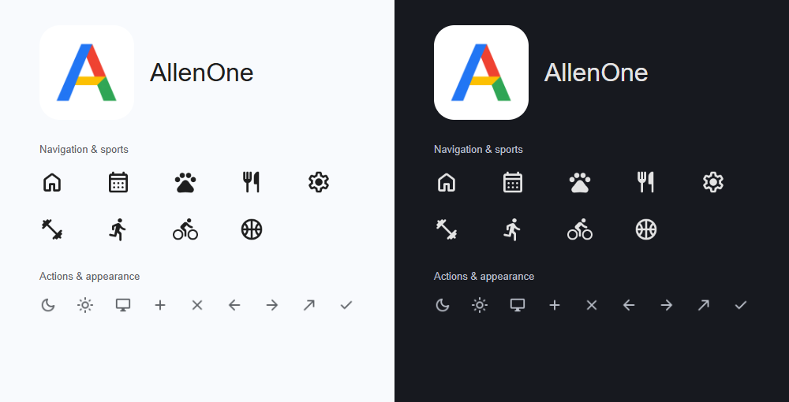

# AllenOne

供个人使用的运动记录与精灵养成 PWA。面向 iPhone，支持 Windows 本地开发；无需登录，记录保存在当前设备，提供完整备份与迁移说明。



> 当前为开发版。主应用在 `app/`，可构建为静态 HTTPS 网站。尚未完成 iPhone 真机验收；24 位精灵中已有 22 套动画，马和鳐的动画仍待补充。

## 功能

- **运动记录**：力量逐组重量／次数、跑步距离／配速、骑行距离／均速、篮球起止时间，支持补记、编辑和删除。
- **力量训练**：12 个内置动作与示意、自定义动作、训练模板、上次记录、训练计时、前台组间休息提醒及草稿恢复。
- **统计回看**：运动日历、周／月天数与时长、分类汇总、力量动作历史。
- **放纵餐**：北京时间每周最多一次达标，确认后结算；连续达标 +1、+2、+4…，连续超标 −2、−4、−8…，切换后重置倍数。
- **精灵养成**：总分与各精灵分独立维护，当前装配精灵接收周结算；永久解锁、装配、成长预览与预渲染逐帧动画。
- **主题与离线**：Google Material 风格，浅色／深色／跟随系统；首次完整缓存后可离线打开与记录。
- **备份迁移**：完整 JSON 导出／导入、运动 CSV、机器可读 Schema 和明确标注的虚构示例。

## 本地开发

需要 Node.js 22 或更高版本及 npm，建议使用 Node.js 24。

```sh
npm ci --ignore-scripts
npm run build
npm start
```

Windows PowerShell 若限制执行 npm 脚本，可将 `npm` 写作 `npm.cmd`。

打开 [本地预览](http://127.0.0.1:4180)。服务只监听本机；源码修改后再次执行 `npm run build`。手机不能通过电脑的 `127.0.0.1` 地址访问此服务。

正式应用使用原生 JavaScript、IndexedDB、Canvas 2D、Manifest 和 Service Worker，无需后端或运行时 CDN。旧 Three.js 模型与原型仅作为历史保留，不进入正式构建。

## Cloudflare Pages 部署

将代码推送至 GitHub，在 Cloudflare 选择 **Workers & Pages → 创建应用 → Pages → 连接 Git**，选择本仓库。

| 设置 | 值 |
| --- | --- |
| 生产分支 | `main` |
| 框架预设 | `None` |
| 构建命令 | `npm run build` |
| 构建输出目录 | `dist` |
| 根目录 | 留空（仓库根目录） |
| Node.js 版本 | 如需显式配置，设置环境变量 `NODE_VERSION=24` |

运行资源已包含在仓库中，部署时不需要重新生图、安装浏览器或重新生成图标。只发布 `dist/`，不要把项目根目录作为发布目录。

部署后使用稳定的生产 HTTPS 地址。iPhone Safari 打开后，通过“分享 → 添加到主屏幕”安装；首次联网等待资源缓存完成，再测试离线记录。

参考：[Cloudflare Git 部署](https://developers.cloudflare.com/pages/get-started/git-integration/)、[iPhone 添加网站到主屏幕](https://support.apple.com/guide/iphone/iphea86e5236/ios)。

## 发布更新

1. 修改源码并在本地构建、验证。
2. 检查暂存内容，提交并推送至 `main`。
3. 已连接的 Cloudflare Pages 自动构建并发布到原生产地址。
4. 手机联网打开以下载新版本；当前没有“发现新版本”提示，可能需要关闭 AllenOne 和同站点 Safari 页面，再重新打开。

构建根据资源内容生成新离线缓存版本。正常资源更新不清空 IndexedDB；若变更数据结构，需要另行实现迁移。请勿用清除网站数据作为日常更新方式。

## 数据与隐私

- 当前没有账号、服务端数据库、健康数据上传或跨设备同步。部署到网上不代表数据已获得云备份。
- 记录保存在当前浏览器／设备的 IndexedDB 中。更换手机或域名后，通过完整 JSON 备份迁移；重要记录应定期自行备份。
- 仓库只应包含代码、美术资源、设计说明、测试及虚构示例。`app/example-backup.json` 由 `scripts/artifacts.mjs` 生成，包含明确标注的虚构记录。
- `.gitignore` 排除环境变量、密钥文件、个人备份／CSV、浏览器认证状态、数据库、测试输出、依赖与构建目录；真实备份统一放在 `backups/` 或 `exports/`。
- 请勿把真实健康数据放入 `app/`：其内容会被打包公开发布。忽略规则不能替代对新文件的人工检查。
- 备份导入为确认后的完整替换，不会自动合并；CSV 仅含运动明细，完整归档请保留 JSON。

备份合同见 [数据格式](app/DATA_FORMAT.md)、[JSON Schema](app/backup.schema.json)、[虚构示例](app/example-backup.json)。

## 验证

```sh
npm test
npm run build
```

浏览器回归需要先运行本地服务；现有脚本使用 Windows 默认安装路径的 Microsoft Edge 和 Playwright：

```sh
npm run check
node tests/settlement-browser.mjs
node tests/timers-browser.mjs
node tests/appearance-browser.mjs
node tests/animation-browser.mjs
```

测试使用独立浏览器上下文，结果保存在忽略目录 `test-results/`。桌面手机宽度模拟不能代替 iPhone Safari 的安装、触控、后台恢复和长期存储验证。

## 目录

| 目录 | 用途 |
| --- | --- |
| `app/` | 正式应用源码与运行资源 |
| `scripts/` | 构建、本机服务、资源打包与预览 |
| `tests/` | 业务与浏览器回归 |
| `Projects/` | 项目记忆、需求、设计决策和素材来源 |
| `prototypes/pet3d/` | 历史探索原型 |
| `dist/` | 自动生成的发布目录，不提交 Git |

项目协作从 [AGENTS.md](AGENTS.md) 和 [项目记忆索引](Projects/README.md) 开始。当前实现与限制见 [实施状态](Projects/IMPLEMENTATION.md)。

## 图标与美术来源

品牌 A 和精灵图集通过内置生图工具制作，原图及提示词保存在 `Projects/assets/`。精灵动画为预渲染逐帧表现，不是实时 3D 或连续骨骼动画。

单色 UI 图标来自 Google Material Symbols Rounded，采用 Apache-2.0 许可；本地 PNG 仅作格式转换。见 [图标规范](Projects/ICON_SYSTEM.md)、[许可证](app/assets/ui-icons/LICENSE.txt) 和 [来源声明](app/assets/ui-icons/NOTICE.txt)。其他依赖遵循各自许可证。
